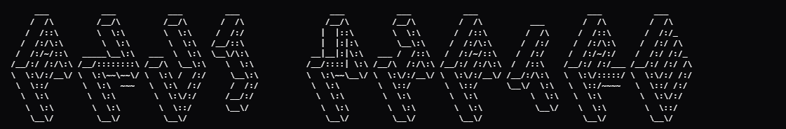

  
   
  
   
  
    
  
  
  
  
  
  

---

### &gt;_ whoami

### &lt; skills /&gt;

### % top languages

### # currently building

  
  

### % the numbers

### 🐍 contribution snake

  
  
<code>// feed the snake — it eats your commits</code>

### @ connect

