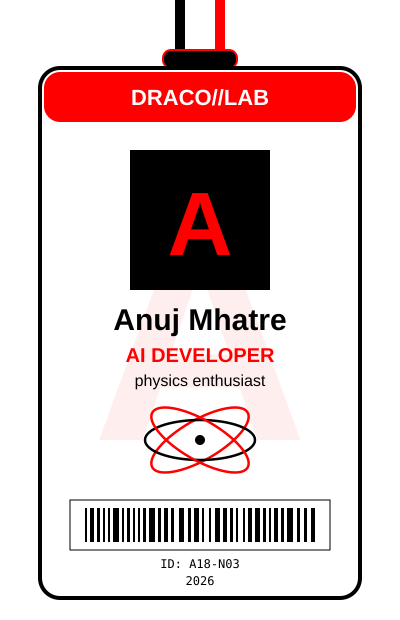
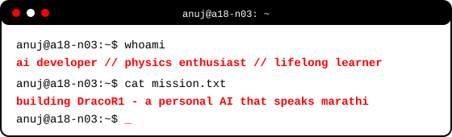

  
  
  

---

<b>hi, i'm anuj</b>

lowercase code. high-energy ideas. building intelligent things with physics, python, and javascript.

currently building <b>DracoR1</b> // experimenting with ai // making systems move.

---

---

<b>stats</b>

  
  

---

<b>the stack</b>

  
  
  
  
  
  
  
  

---

<b>my graph</b>

---

end of transmission // <b>a18-n03</b>

built with ♥ // lowercase everything // red is the new black

