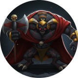
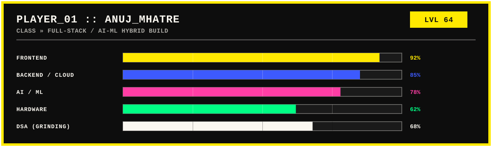

<p align="center">
  
</p>

<p align="center">
  
</p>

<p align="center">
  
</p>

<p align="center">
  
  
  
  
</p>

<p align="center"></p>

### &gt;_ whoami

```bash
anuj@navi-mumbai:~$ whoami
> BTech CSE (AI & ML) @ CSMU — second year
> Part-time @ Mind Space, Airoli, Navi Mumbai
> Full-stack dev: React · Vite · TypeScript · Node.js · Express · Supabase · Firebase
> Fine-tuned DeepSeek-R1-Distill-Qwen-7B -> DracoR1 (Unsloth + QLoRA, Colab T4)
> Right now: routing a 4x4 mechanical macropad PCB & grinding DSA in C++
> Side quests: Minecraft modding, BGMI, One Piece
> End goal: ship into a top AI company
anuj@navi-mumbai:~$ _
```

<p align="center">
  
</p>

<p align="center"></p>

### ⚡ tech stack

**Frontend**

<p align="left">
  
  
  
  
</p>

**Backend & Cloud**

<p align="left">
  
  
  
  
</p>

**AI / ML**

<p align="left">
  
  
  
  
</p>

**Hardware & Tools**

<p align="left">
  
  
  
  
  
</p>

<p align="center"></p>

### 🛠 currently building


> **🧠 [DracoR1](https://github.com/a18-n03/draco-r1)**
> Personal AI — DeepSeek-R1-Distill-Qwen-7B fine-tuned on a 185-example custom dataset (math, coding, English, Marathi) with Unsloth + QLoRA on a free Colab T4.
> `PyTorch` `Unsloth` `Hugging Face` `Google Colab`


> **🔩 Custom Mechanical Macropad**
> A 4×4 hotswap matrix with dual independent rotary encoders, running on a Seeed XIAO nRF52840, switchable between wired and BLE. Schematic → routed PCB → Gerbers exported and heading to fab, with a 3D-printed case underway.
> `KiCad` `FreeRouting` `Onshape` `Embedded`


> **🎵 Sonica**
> A Spotify-inspired music streaming app — React + Vite + TypeScript on the front end, Firebase Auth, Supabase for storage, with self-hosted audio and YouTube IFrame playback.
> `React` `Supabase` `Firebase`

<p align="center"></p>

### 📊 the numbers

<p align="center">
  
  
</p>
<p align="center">
  
</p>

<p align="center">
  
</p>

<p align="center"></p>

### 🔗 connect

<p align="center">
  <a href="mailto:anujmhatre125@gmail.com"></a>
  <a href="https://linkedin.com/in/YOUR-LINKEDIN"></a>
  <a href="https://github.com/a18-n03"></a>
</p>

<p align="center">
  
</p>